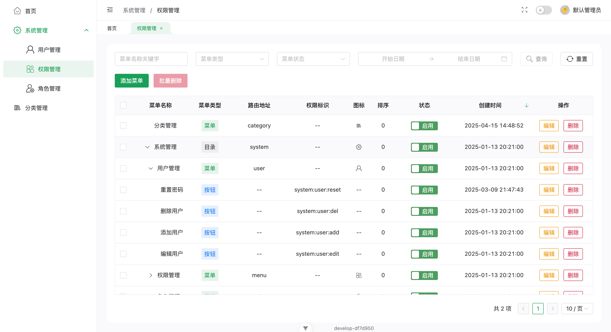

简体中文 | [English](/README.md)

# blog-admin-next

一个博客管理系统，使用 Vue 3、Vite、TS、Pinia、Axios、naive-ui、ECharts、md-editor-v3 等技术开发。

## 功能特性

- 使用动态路由实现权限控制，支持为用户赋予按钮级权限；
- 内置白色主题和暗黑主题，支持绑定切换；
- 使用 Markdown 编辑器编写文章；
- 使用 Vitest 进行单元测试；
- 使用 pnpm 进行包管理；
- 使用 Docker 部署。

## 预览图

### 登录页


### 权限管理页



## 快速开始

### 克隆项目

```bash
git clone https://github.com/wansongtao/blog-admin-next.git
```

### 安装依赖

```bash
pnpm install
```

### 启动项目

```bash
pnpm dev
```

### 打包项目

```bash
pnpm build
```

## 许可证

[MIT](/LICENSE)
